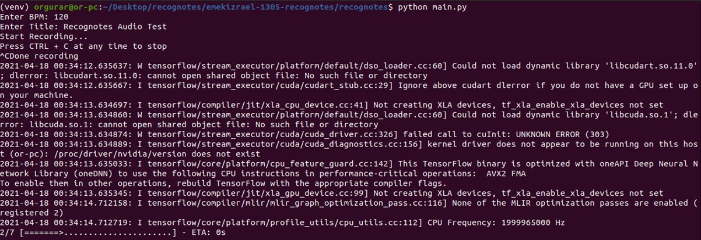

# RecogNotes

Audio analyzer and notes detection for musicians.
RecogNotes software will listen to your music through the microphone,
and process the audio signals to music sheets in the easiest way posiible.
Using our unique algorithm is easy and reliable.



## Getting Started

These instructions will get you a copy of the project up and running on your local machine for development and testing purposes.

See Prerequisites for an early manual installations.

### Prerequisites

Recognotes runs on python 3.8.

Also, on an Ubuntu machine make sure you run the following commands

```
sudo apt-get install lilypond
sudo apt-get install libasound-dev portaudio19-dev libportaudio2 libportaudiocpp0
sudo apt-get install ffmpeg libav-tools
```

### Installing

Install every requiered python module to run the software by using the following command, it might take a few minutes

```
pip install -r requirements.txt
```

## Running RecogNotes

In order to run RecogNotes cd the 'recognotes' dir and start the main file.

```
cd recognotes/
python main.py
```

Moreover, to get the full usage instructions, use this command

```
python main.py -h
```

### Running Pure Tones Tests

In the folder 'test-wavfiles' you will find some one-frequency .wav file in a different sample rates.
As we mentioned in the usage instructions, you can specify the file and sample rate you would like to try.

For example, run the software with the 1000.wav file in the 44.1kHz dir:

```
cd recognotes/
python main.py -f ../test-wavfiles/44.1kHz/1000.wav -s 44100
```

### Output

RecogNotes will show a pdf file on screen that contains your musical sheet output.

## Built With

- [crepe](https://github.com/marl/crepe) - monophonic pitch tracker based on a deep convolutional neural network
- [Abjad](https://github.com/Abjad/abjad) - wraps the LilyPond music notation package
- [NumPy](https://numpy.org/) - package for scientific computing and audio reading
- [scipy](https://www.scipy.org/) - wavfile I/O tool

## Authors

- **Or Amit Landesman** - Owner and Developer -[oramit1](https://gitlab.com/oramit1)
- **Or Gur Arie** - Owner and Developer - [orgurar](https://gitlab.com/orgurar)

## License

This project is licensed under the MIT License - see the [LICENSE](LICENSE) file for details
